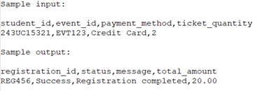

# Campus Event Check-in System with Student ID and Payment Integration

**Term:** 2510  
**Course:** CSE 6234 - Software Requirements Engineering  
**Tutorial:** TT1L  
**Group:** Group 3  

## Group Members

| Name           | Student ID     |
|----------------|----------------|
| Teng Huey Ting | 243UC2461A     |
| Teoh Yi Xin    | 243UC247NT     |
| Yap Yi Ting    | 243UC2462Y     |
| Yee Lee Yiin   | 243UC2461E     |

---

## Table of Contents

1. [Introduction](#1-introduction)  
   1.1 [Purpose](#11-purpose)  
   1.2 [Scope](#12-scope)  
   1.3 [Product Overview](#13-product-overview)  
      1.3.1 [Product Perspective](#131-product-perspective)  
      1.3.2 [Product Functions](#132-product-functions)  
   1.4 [User Characteristics](#14-user-characteristics)  
   1.5 [Limitations](#15-limitations)  
   1.6 [Definitions](#16-definitions)  

2. [Reference](#2-reference)  

3. [Requirement](#3-requirement)  
   3.1 [Functional Requirements](#31-functional-requirements)  
      3.1.1 [Register](#311-register)  
      3.1.2 [Login](#312-login)  
      3.1.3 [Edit Profile](#313-edit-profile)  
      3.1.4 [Browse Event](#314-browse-event)  
      3.1.5 [Register Event](#315-register-event)  
      3.1.6 [Make On-site Purchase](#316-make-on-site-purchase)  
      3.1.7 [Purchase Ticket](#317-purchase-ticket)  
      3.1.8 [View Purchase History](#318-view-purchase-history)  
      3.1.9 [Check-In to the Event](#319-check-in-to-the-event)  
      3.1.10 [View and Download QR Code Ticket](#3110-view-and-download-qr-code-ticket)  
      3.1.11 [Manage Student Account](#3111-manage-student-account)  
      3.1.12 [Manage Event](#3112-manage-event)  
      3.1.13 [Reconcile Payment](#3113-reconcile-payment)  
      3.1.14 [Generate Revenue Report](#3114-generate-revenue-report)  
      3.1.15 [View Attendance Report](#3115-view-attendance-report)  
      3.1.16 [Verify Ticket](#3116-verify-ticket)  
      3.1.17 [Track Attendance](#3117-track-attendance)  
      3.1.18 [Assist On-site Purchase Ticket](#3118-assist-on-site-purchase-ticket)  
      3.1.19 [Refund](#3119-refund)  
      3.1.20 [Handle Request Refund](#3120-handle-request-refund)  

   3.2 [Performance Requirements](#32-performance-requirements)  
   3.3 [Usability Requirements](#33-usability-requirements)  
   3.4 [Interface Requirements](#34-interface-requirements)  
      3.4.1 [System Interface](#341-system-interface)  
      3.4.2 [User Interface](#342-user-interface)  
      3.4.3 [Hardware Interface](#343-hardware-interface)  
      3.4.4 [Software Interface](#344-software-interface)  
      3.4.5 [Communications Interface](#345-communications-interface)  

   3.5 [Logical Database Requirements](#35-logical-database-requirements)  
      3.5.1 [Entity Relationship Diagram (ERD)](#351-entity-relationship-diagram-erd)  
      3.5.2 [Entities](#352-entities)  

   3.6 [Design Constraints](#36-design-constraints)  
   3.7 [Software System Attributes](#37-software-system-attributes)  
   3.8 [Supporting Information](#38-supporting-information)  

4. [Verification](#4-verification)  
   4.1 [Verification Approach](#41-verification-approach)  
   4.2 [Verification Criteria](#42-verification-criteria)  

5. [Appendices](#5-appendices)  
   5.1 [Assumptions and Dependencies](#51-assumptions-and-dependencies)  
   5.2 [Acronyms and Abbreviations](#52-acronyms-and-abbreviations)  

---

## 1. Introduction

### 1.1 Purpose

The **Campus Event Check-in System** is a centralized digital platform designed to modernize event management at **Multimedia University**. It integrates with the university’s:

- **Student Identification Database**
- **Payment Processing System**
- **University Event Calendar**

The system automates the event lifecycle from registration and ticket purchases (online and on-site) to QR code-based check-ins and refund requests. It ensures efficient attendance tracking and verification.

**Key Benefits:**
- **Students** can browse events, edit profiles, download QR tickets, and review their purchase history via a user-friendly interface.
- **Organizers** are equipped with tools to manage events, track attendance, assist with purchases, and generate revenue reports.
- **Administrators** gain oversight into payment reconciliation, account management, and overall event performance.

By eliminating paper tickets and manual attendance logs, the system reduces administrative overhead, enhances data security, and minimizes errors in payment handling. It is scalable for large events and fosters accountability across all users.

---

### 1.2 Scope

The system supports three human actors and three system actors: 
 

**Human Actors**

- **Student**
  - Register and log in using university Student ID
  - Edit personal profile information
  - Browse and search for campus events
  - Purchase event tickets (online/on-site)
  - View, download, and display QR code tickets
  - Check in to events via QR code scanning
  - View purchase history
  - Submit refund requests

- **Event Organizer**
  - View and verify attendee tickets at check-in station
  - Track real-time event attendance
  - Assist with on-site ticket purchases
  - View and generate attendance reports
  - Create, edit, and delete event details

- **Admin**
  - Manage student accounts
  - Create and edit all event details
  - Generate revenue reports
  - View comprehensive attendance reports
  - Handle refund requests

**System Actors**

- **Student Identification Database**
  - Validates student credentials during login and registration
  - Provides secure access to student profiles

- **Payment Processing System**
  - Facilitates online and on-site transactions and refunds
  - Tracks revenue and integrates with financial reporting

- **University Event Calendar**
  - Syncs event schedules to avoid overlaps
  - Displays real-time availability to users

---

### 1.3 Product Overview

#### 1.3.1 Product Perspective

The **Campus Event Check-in System** functions as a centralized event platform, interacting with:

**External Systems**

- **Student Identification Database**
  - Validates student credentials and enrollment status in real-time
  - Allows secure access to student profile editing

- **Payment Processing System**
  - Manages online and on-site ticket purchases and refunds
  - Secures transaction data and syncs payment records with revenue reports

- **University Event Calendar**
  - Synchronizes event details (date, time, venue) for student browsing
  - Prevents schedule conflicts through automated availability updates

**Physical Components**

- **Mobile Devices**
  - Students use smartphones to display QR code tickets
  - Event organizers use tablets to:
    - Scan tickets
    - Process on-site ticket purchases
    - Manage events and view attendance dashboards
  - Admins use devices to:
    - Handle refund requests
    - View attendance reports
    - Manage events

---

**Context Diagram**

*Figure 1.3.1.1Contest Diagram*

---

## 1.3.2 Product functions

| **Actor**         | **Functions**                                                                                                                                   |
|-------------------|-----------------------------------------------------------------------------------------------------------------------------------------------------------------|
| **Student**        | - Log in via Student ID    - Edit Profile    - Browse events    - Register for events    - Scan QR/ID at check-in   - Pay for tickets online   - View/download QR code   - View purchase history   - Request refund |
| **Event Organizer**| - Log in to the system   - Add, edit, and delete events   - View and generate attendance reports   - Validate check-in   - Monitor and update attendance   - Help students buy tickets on-site |
| **Admin**          | - Log in to the system   - Modify student account information   - Create and edit event details   - Create financial reports on ticket sales   - Audit transactions   - View and generate attendance reports   - Handle refund requests |

---

### 1.3.3 User characteristics

| User            | Technical Proficiency        | Primary Tasks                                                                                                                                                                     | Access Method                    | Frequency of Use                                        |
|-----------------|------------------------------|------------------------------------------------------------------------------------------------------------------------------------------------------------------------------------|----------------------------------|----------------------------------------------------------|
| **Student**      | -	Need to have basic computer skills        | •Register via Student ID   •	login via Student ID   •	Edit profile   •	Browse event   •	purchase tickets   •	QR code to check-in the event   •	View purchase history   •	Submit refund request   •	Register event | -	Mobile device | •	Intermittent (during event registration/ attendance) | 
| **Event Organizer**| -	Intermediate technical skills | •	Login to the system   •	Create, edit, delete event detail   •	Validate tickets   •	Track real-time attendance   •	Manage on-site sales   •	Generate reports |   -	Mobile device   -	Tablet   -	Desktop | •	High during events   •	Moderate for planning   •	For reporting |
| **Admin** | -	Advanced system knowledge   •	Login to the system   •	Manage accounts   •	Reconcile payments   •	Create and edit event detail   •	Generate analytics   •	Handle refund request | -	Desktop | •	Daily for maintenance   •	For reporting | 

 

---

### 1.3.4 Limitations

The Campus Event Check-in System has several key limitations that may impact its functionality and performance:

1. **Systemic Limitations**
- Restricted to events within the campus
- Requires continuous internet connectivity for full functionality
- Limited to events registered through the official university event calendar

2. **Technical Constraints**
- Supports only university-issued student identification
- Requires compatible mobile devices for QR code scanning and ticket display
- Performance may be affected by network bandwidth and stability
- Limited to web and mobile application platforms

3. **Authentication and Access Limitations**
- User access strictly controlled by university credentials
- No support for external or guest event registrations
- Role-based access limits certain functionalities for different user types

4. **Data and Privacy Limitations**
- Bound by university data protection and privacy policies
- Limited data retention based on institutional guidelines
- Personal information usage constrained by institutional regulations

5. **Operational Restrictions**
- Event capacity managed by existing university infrastructure
- Check-in process dependent on functional check-in stations
- Limited customization of system features

---

### 1.4 Definitions

| Term                       | Definition                                                                                                      |
|----------------------------|-----------------------------------------------------------------------------------------------------------------|
| **Student**                | An enrolled university student registered in the system who can browse events, purchase tickets, and check-in to events. |
| **Event Organizer**        | University staff or authorized personnel who manage events, verify tickets, and monitor attendance through the system. |
| **Admin**                  | Administrative staff with system-level privileges for user management, manage events, payment reconciliation, and report generation. |
| **Student Identification Database** | The university's official database containing student credentials (ID numbers, names) used for system authentication. |
| **Payment Processing System** | The university-approved financial gateway integrated with the system for secure ticket transactions.            |
| **University Event Calendar** | The official centralized calendar where all approved campus events are listed with dates, times, and locations.  |
| **Campus Event Check-in System** | The digital platform described in this SRS that manages event registration, ticket processing, and attendance tracking at university. |
| **Ticket**                 | A digitally generated ticket containing a unique QR code linked to a student's ID and event registration, used for verification at check-in stations. |

---

## 2. Reference

IEEE. (2018). *ISO/IEC/IEEE 29148:2018 Systems and software engineering—Life cycle processes— Requirements engineering*.  
[https://www.iso.org/standard/72089.html](https://www.iso.org/standard/72089.html)

---

## 3. Requirement

### 3.1	Functional Requirements 

The Campus Event Check-in System involves several key actors working together to manage campus events effectively. Students are the primary users who register accounts, browse events, purchase tickets online or on-site, and check into events using QR code tickets. They can also request refunds, view purchase history, and update profiles, interacting mainly with the University Event Calendar for event details and using QR codes for secure entry. 
 

Event Organizer is responsible for creating and managing events. Organizer list events on the calendar, verify tickets through QR code scanning, track real-time attendance, assist with on-site purchases, and generate post-event reports for analysis and future planning.

Admin can oversee the entire system by managing student accounts, handling refund requests, and reconciling transactions through the Payment Processing System. Admin generate reports on revenue and attendance, maintain system security, and address any technical or administrative issues.

The University Event Calendar serves as the central platform for listing all events, providing real-time updates on dates, locations, and ticket availability. It ensures smooth coordination between event creation, ticketing, and check-ins.
The Payment Processing System handles secure financial transactions, including ticket purchases and refunds. It verifies student accounts through the Student Identification Database and ensures accurate reconciliation.

The Student Identification Database manages student profiles, authenticates logins, validates QR codes during check-ins, and supports secure transactions by sharing data with the payment system. It is essential for user verification and maintaining data integrity.

--- 

###Use Case Diagram

*Figure 3.1.0.1 Use Case Diagram*

---

### 3.1.1 Register

| Use Case         | 1                                                                                  |
|------------------|-----------------------------------------------------------------------------------|
| Use Case Name    | Register                                                                          |
| Actor            | Student                                                                           |
| Description      | Allow a new student to create an account in the system by providing required information |
| Pre-condition    | 1. The student is not already registered in the system. 2. The registration page is accessible. |
| Basic Course Flow| 1. Students navigate to the registration page. 2. The system displays a registration form. 3. Students fill in the required fields (e.g. name, email, phone number, password). 4. Students submit the form after filling out all the required fields. 5. The system validates the input data. 6. The system creates a new student account. 7. The system confirms successful registration and may redirect the student to the login page. |
| Post Condition   | 1. A new student account is successfully created and stored in the system's database. 2. Students can log in with their credentials. |
| Alternative Flow | *Invalid Input: - The system detects any required field that is missing or invalid. - The system displays error messages.  Student already registered:* - The provided email or student ID already exists in the system. - The system displays an appropriate error message. |

**Activity diagram**

This activity diagram illustrates the process a student follows to register a new account in the Campus Event Check-in System. It begins when the student accesses the registration page and enters the required details. The system validates the input, checks existing accounts, and upon successful validation, creates a new student profile. If any errors occur (e.g., duplicate Student ID), appropriate messages are displayed.

*Figure 3.1.1.1 Register (Activity Diagram)*

---

### 3.1.2 Login

| Use Case         | 2                                                                                  |
|------------------|-----------------------------------------------------------------------------------|
| Use Case Name    | Login                                                                             |
| Actor            | Student, Admin, Event Organizer                                                   |
| Description      | Allow users (Student, Admin, or Event Organizer) to log into the system by entering valid credentials. |
| Pre-condition    | 1. The user must already be registered in the system. 2. User must enter correct email and password. 3. The login page must be accessible. |
| Basic Course Flow| 1. User navigates to the login page. 2. The system displays the login form. 3. The user enters their email and password. 4. Users submit the form by clicking the "Login" button. 5. The system validates credentials. 6. The system redirects the user to their appropriate dashboard based on their role. |
| Post Condition   | 1. Users are successfully authenticated and have access to their respective dashboard and functionalities. |
| Alternative Flow | *Invalid Credentials: - The system detects the entered email or password is incorrect. - Display an error message.  Forgot Password: - Users click the "Forgot Password" link - The system prompts the user to enter their registered email.  Nonexistent Account:* - Displays error message "Account doesn't exist" - Users need to click "Sign Up" button to register an account |

**Activity diagram** 

This activity diagram shows how users log in to the system. It includes steps for entering details, checking if they are correct, handling wrong logins, and resetting forgotten passwords.

*Figure 3.1.2.1 Login (Activity Diagram)*

---

### 3.1.3 Edit Profile

| Use Case         | 3                                                                                  |
|------------------|-----------------------------------------------------------------------------------|
| Use Case Name    | Edit Profile                                                                      |
| Actor            | Student                                                                           |
| Description      | Allow students to update their personal profile information.                      |
| Pre-condition    | 1. Student must be logged into the system. 2. The profile data must already exist in the database. |
| Basic Course Flow| 1. Students navigate to their profile page. 2. The system displays the current profile information. 3. Students click the "Edit Profile" button. 4. The system enables editable form fields. 5. Students update the desired information. 6. Students click the "Submit" button after completing the editing. 7. The system validates the input and updates the database. 8. The system confirms that the profile has been successfully updated. |
| Post Condition   | 1. The student's profile is updated, and the new information is stored in the system. |
| Alternative Flow | *Invalid input:* - The system detects any required field that is missing or invalid. - The system displays error message. |

**Activity diagram** 

This activity diagram outlines the process a student undertakes to update their profile information. The system validates the new data and saves it or shows an error if the input is invalid.

*Figure 3.1.3.1 Edit Profile (Activity Diagram)*

---

### 3.1.4 Browse Event

| Use Case         | 4                                                                                  |
|------------------|-----------------------------------------------------------------------------------|
| Use Case Name    | Browse Event                                                                      |
| Actor            | Student, Admin                                                                   |
| Description      | Allow students and admins to view available events posted in the system.          |
| Pre-condition    | 1. The users (students and admin) must be logged into the system. 2. Events must already exist in the system database. |
| Basic Course Flow| 1. Student or admin navigates to the "Events" section of the system. 2. The system retrieves and displays a list of all available events. 3. The user selects an event to view more details. 4. The system displays the selected event information (e.g., event name, date, time, venue, description). |
| Post Condition   | 1. The user has successfully viewed the available event and their details.        |
| Alternative Flow | *No event available:* - The system checks the event database and finds no events. - The system displays a message: "No events are currently available." |

**Activity diagram** 

This diagram represents how students and admins explore the list of upcoming campus events. Events are listed, and users can select one to see its details. A message is shown if no events are available.

*Figure 3.1.4.1 Browse Event (Activity Diagram)*

---

### 3.1.5 Register Event
| Use Case         | 5                                                                                  |
|------------------|-----------------------------------------------------------------------------------|
| Use Case Name    | Register Event                                                                    |
| Actor            | Student                                                                          |
| Description      | Allow students to register for an event listed in the system.                     |
| Pre-condition    | 1. The student must be logged into the system.                                   |
| Basic Course Flow| 1. Students navigate to the "Events" section of the system. 2. Students select an event they want to participate in. 3. The system displays the event details and the option to register. 4. Students click the "Register" button. 5. The system registers the student for the event. 6. The system updates the registration list and sends a confirmation notification or message. 7. Students receive confirmation of successful registration and may view their registered events. |
| Post Condition   | 1. Student is successfully registered for the selected event, and the registration is stored in the system. |
| Alternative Flow | *Registration Closed:* - The system displays a message indicating that registration is closed. - Students cannot proceed with registration. |

**Activity diagram** 

This activity diagram depicts how a student registers for an available campus event. The system checks availability and confirms registration, then adds the student to the event list.

*Figure 3.1.5.1 Register Event (Activity Diagram)*

---

### 3.1.6 Make On-site Purchase

| Use Case         | 6                                                                                  |
|------------------|-----------------------------------------------------------------------------------|
| Use Case Name    | Make On-site Purchase                                                            |
| Actor            | Student                                                                          |
| Description      | Allow students to make a purchase directly at the event or system's physical location. |
| Pre-condition    | 1. The student must be physically present at the event or system's designated on-site location. 2. Tickets must be available for the event. |
| Basic Course Flow| 1. Student approaches the ticket counter or sales representative. 2. Student requests to purchase a ticket for a specific event. 3. Event organizer checks ticket availability. 4. Student provides payment. 5. System processes payment and confirms transaction. 6. System generates a QR code ticket linked to the student and the event. 7. QR code is sent to the student via email. 8. Purchase is recorded in the system, and QR is registered for validation. |
| Post Condition   | 1. Ticket is successfully issued to the student. 2. System updates the ticket inventory and logs the transaction. |
| Alternative Flow | *Ticket sold out:* - Event organizers notify the students. - Students failed to purchase ticket. |

**Activity diagram** 

This diagram shows the on-site ticket purchasing process at an event location. The event organizer checks availability, processes payment, and the system issues a QR ticket.

*Figure 3.1.6.1 Make on-site Purchase (Activity Diagram)*

---

### 3.1.7	Purchase Ticket

| Use Case         | 7                             |
|------------------|-------------------------------|
| Use Case Name    | Purchase Ticket               |
| Actor           | Student                       |
| Description     | Allow students to use the system to purchase tickets for events. |
| Pre-condition   | 1. Student is logged in. 2. Student selects an event. |
| Basic Course Flow| 1. Student clicks “Purchase Ticket” button. 2. System shows ticket details. 3. Student confirms details and pays. 4. Payment processing system verifies payment. 5. System generates a QR code ticket. 6. Ticket is saved to purchase history. |
| Post Condition  | 1. Student receives a valid QR code ticket. 2. Ticket is saved in purchase history. |
| Alternative Flow| 1. Payment failed: system shows error message. 2. Tickets sold out: purchase process stops. |

**Activity diagram** 

This activity diagram captures the process a student follows to buy an event ticket through the system. The student logs in, selects an event, and confirms ticket details. The system interacts with the Payment Gateway to process the transaction, then generates and stores a QR code ticket for future event check-in.

*Figure 3.1.7.1 Purchase Ticket (Activity Diagram)*

---

### 3.1.8	View Purchase History

| Use Case      | 8                                                     |
|---------------|-------------------------------------------------------|
| *Use Case Name*  | View Purchase History                                |
| *Actor*          | Student                                             |
| *Description*    | Allows the student to view a list of all past event ticket purchases for reference or verification. |
| *Pre-condition*  | 1. Student has an account and login to the website. |
| *Basic Course Flow* | 1. Student log in to the system. 2. Student clicks the “Purchase History” page. 3. System will display the list of all past transactions. 4. Student can view transaction details. |
| *Post Condition* | 1. Student views the purchase records for previous campus events. |
| *Alternative Flow* | If no history is found, system displays “No record available.” |

**Activity diagram** 

This activity displays a list of all event ticket purchases made by the student, allowing them to review event names, dates, payment status and transaction details.

*Figure 3.1.8.1 View Purchase History (Activity Diagram)*

---

### 3.1.9	Check-In to the Event

| Use Case        | 9                                                       |
|-----------------|---------------------------------------------------------|
| *Use Case Name* | Check In to the Event                                   |
| *Actor*         | Student                                                |
| *Description*   | Allows a student to check in to a campus event using a valid QR code that was generated after purchasing a ticket. |
| *Pre-condition* | 1. Student has an account and login to the website. 2. Purchased a ticket for the event. |
| *Basic Course Flow* | 1. Student arrives at the event venue. 2. Student opens the system and selects the event. 3. Show the QR code. 4. Staff event scans the QR code. 5. System will verify the code and records the check-in time. 6. System will show the message successful check-in. |
| *Post Condition*  | 1. Student’s attendance is marked as “checked-in” and date time is recorded. |
| *Alternative Flow* | If the QR code is invalid, system will display an error message and not allow to check-in. If the student has not purchased the ticket, system will notify a message “No ticket found.” |

**Activity diagram** 

This activity allows students to check in to a campus event by scanning their QR code tickets, which verifies attendance and logs the check-in timestamp into the system.

*Figure 3.1.9.1 Check-In to the Event (Activity Diagram)*

---

### 3.1.10	View and Download QR Code Ticket

| Use Case        | 10                                                      |
|-----------------|---------------------------------------------------------|
| *Use Case Name* | View and Download QR Code Ticket                        |
| *Actor*         | Student                                                |
| *Description*   | Enables the student to view and download the QR code ticket after purchasing a campus event ticket. |
| *Pre-condition* | 1. Student has an account and login to the website. 2. Student already purchased the event ticket. |
| *Basic Course Flow* | 1. Student log in to the system. 2. Student clicks the “My events”. 3. System displays a list of purchased events. 4. Student selects the event. 5. System shows the information about the event and the QR code. 6. Student clicks the “Download” button to save the QR code. |
| *Post Condition*  | 1. Student successfully views and downloads the QR code for offline use. |
| *Alternative Flow* | If no ticket is found, system will show the error message “No ticket found”. |

**Activity diagram** 

This activity enables students to access their purchased tickets by viewing the QR codes on the platform to download the QR code for offline use or event entry.

*Figure 3.1.10.1 View and Download QR Code Ticket (Activity Diagram)*

---

### 3.1.11	Manage Student Account

| Use Case         | 11                                          |
|------------------|---------------------------------------------|
| Use Case Name    | Manage Student Account                       |
| Actor           | Admin                                       |
| Description     | Allows admins to create, update, or delete student account information in the system. |
| Pre-condition   | 1. Admin is logged in the system. 2. Admin has access to the student accounts section. |
| Basic Course Flow| 1. Admin navigates to “Manage Student”. 2. Chooses an action:  *Create Student Account: 1. Admin enters required information. 2. Submits the form. 3. Displays “Account created successfully.”  Update Student Account: 1. Selects student account to update. 2. Enters information and submits form. 3. Displays “Account successfully updated.”  Delete Student Account:* 1. Selects student account to delete. 2. Displays “Account deleted.” |
| Post Condition  | Create, updat, or delete student accounts in the system. |
| Alternative Flow| 1. Invalid Data: - If admin enters invalid data, system displays an error message. |

**Activity diagram** 

This diagram shows how an admin can manage student account information. The admin can choose to create, update, or delete a student profile. The system validates input, stores the changes in the database.

*Figure 3.1.11.1 Manage Student Account (Activity Diagram)*

---

### 3.1.12	Manage Event

| Use Case         | 12                                                                                  |
|------------------|-------------------------------------------------------------------------------------|
| Use Case Name    | Manage Event                                                                        |
| Actor           | Admin (create, edit)   Event Organizer (create, edit, delete)                    |
| Description     | Allow admin and event organizer to manage events (create, edit, or delete).          |
| Pre-condition   | 1. The user is logged in the system. 2. Users have access to manage events.       |
| Basic Course Flow| 1. Navigate to Manage Event page. 2. The system displays a list of events. 3. Choose an action:  *Create Event: 1. Open event creation form. 2. Fill in event details (name, date, location, price, etc). 3. Submit the form. 4. System saves the event and confirms success.  Edit Event: 1. Select an event to edit. 2. Show event details and editable form. 3. Modify required fields. 4. Save changes. 5. System updates event and confirms success.  Delete Event:* 1. Select an event to delete. 2. System removes the event and updates the list. |
| Post Condition  | 1. Create/Edit: The event details saved in system. 2. Delete: The event removed from system. |
| Alternative Flow| 1. Invalid Input: If enters invalid input, the system will diaplay an error message. 2. No Deletion Access: If admin try to delete, the system rejects and displays message. |

**Activity diagram** 

This activity diagram shows admins or event organizers can create new events, update event details, or delete existing events. The system processes each action and ensures events are properly listed or removed in the system database.

*Figure 3.1.12.1 Manage Event (Activity Diagram)*

---

### 3.1.13	Reconciles Payment

| Use Case         | 13                                  |
|------------------|-------------------------------------|
| Use Case Name    | Reconciles Payment                  |
| Actor           | Admin                               |
| Description     | Allows admin to verify, match and reconcile payment records to ensure financial correctness. |
| Pre-condition   | 1. Admin is logged in the system. 2. Payment data is available. |
| Basic Course Flow| 1. Navigate to Reconciles Payment page. 2. System shows the payment records. 3. Admin reviews and reconciles records. 4. Admin marks it as “Reconciled.” 5. System updates status. |
| Post Condition  | 1. Payments are marked as reconciled. |
| Alternative Flow| 1. Payment mismatch: - Admin marks the transaction for investigation. |

**Activity diagram** 

This activity diagram outlines the admin's process for reviewing and verifying payment records. The admin accesses payment data, confirms the accuracy of each record, marks reconciled entries, and flags mismatches for further investigation.

*Figure 3.1.13.1 Reconciles Payment (Activity Diagram)*

---

### 3.1.14	Generate Revenue Report

| Use Case         | 14                                        |
|------------------|-------------------------------------------|
| Use Case Name    | Generate Revenue Report                    |
| Actor           | Admin                                     |
| Description     | Allows admin to generate a summary report of total revenue. |
| Pre-condition   | 1. Admin logged in system. 2. Revenue and payment data is available. |
| Basic Course Flow| 1. Navigates to “Generate Revenues Report” page. 2. Select the date range or event. 3. The system captures relevant payment data. 4. The system generates and displays reports. 5. Admin can download/export the report. |
| Post Condition  | 1. Revenue report is generated and can be downloaded or viewing. |
| Alternative Flow| 1. No payment data available: - System displays “No data found for the selected range.” |

**Activity diagram** 

This activity diagram presents the steps the admin takes to generate a revenue report. The admin selects a time range or specific event, and the system retrieves relevant payment data to compile and display a report. The report can be exported for recordkeeping.

*Figure 3.1.14.1 Generate Revenue Report (Activity Diagram)*

---

### 3.1.15	View Attendance Report

| Use Case | 15 |
|----------|----|
| Use Case Name | View Attendance Report |
| Actor | Admin, Event Organizer |
| Description | Allows admin to view the attendance report. |
| Pre-condition | 1. Admin is logged into the system.  2. Attendance data is available. |
| Basic Course Flow | 1. Navigates to “View Attendance Report” page.  2. Displays a list of events.  3. Selects an event to view attendance report.  4. Shows the attendance data for that event. |
| Post Condition | 1. Admin successfully views the attendance report. |
| Alternative Flow | 1. No attendance data found:  &nbsp;&nbsp;- System displays “No attendance records available.” |

**Activity diagram** 

This activity diagram depicts how admins or event organizers access attendance reports. After logging in, they select an event from a list. The system then displays attendance data for the selected event.

*Figure 3.1.15.1 View Attendance Report (Activity Diagram)*

---

### 3.1.16	Verify Ticket 

| Use Case | 16 |
|----------|----|
| Use Case Name | Verify Ticket |
| Actor | Event Organizer |
| Description | Enables event organizers to validate attendee tickets (QR codes) at check-in stations to grant event entry. |
| Pre-condition | 1. Event organizer is logged into the system.  2. The event is in active status.  3. Check-in station. |
| Basic Course Flow | 1. Student presents ticket like QR code at check-in station.  2. Organizer scans/enters ticket ID using system interface.  3. System validates tickets by checking:  &nbsp;&nbsp;a. Existence: Ticket is registered in the database.  &nbsp;&nbsp;b. Validity: Ticket matches the current event.  &nbsp;&nbsp;c. Status: Not already used/expired.  4. If valid, system:  &nbsp;&nbsp;a. Marks ticket as "used".  &nbsp;&nbsp;b. Updates live attendance count.  &nbsp;&nbsp;c. Displays confirmation.  5. Organizer grants physical entry to attendee. |
| Post Condition | 1. Ticket status is updated to "used" in the database.  2. Attendance records reflect the check-in.  3. Real-time dashboards “Track Attendance” are updated. |
| Alternative Flow | 1. Invalid Ticket:  &nbsp;&nbsp;- System displays error reason.  &nbsp;&nbsp;- Event Organizer denies entry and directs attendee to help desk. |

**Activity diagram** 

This diagram shows the ticket verification process. An attendee presents their ticket, the organizer scans it, and the system checks validity. Valid tickets are marked as used, updating attendance and granting entry. Invalid tickets trigger an error and denied entry.

*Figure 3.1.16.1 Verify Ticket (Activity Diagram)*

---

### 3.1.17	Track Attendance

| Use Case | 17 |
|----------|----|
| Use Case Name | Track Attendance |
| Actor | Event Organizer |
| Description | Allow event organizer to monitor real-time attendance data for an event, including check-in status, attendee demographics, and capacity tracking. |
| Pre-condition | 1. Event organizer is logged into the system with valid credentials  2. The event has been created in the system and is in active status  3. At least one ticket has been purchased for the event |
| Basic Course Flow | 1. Organizer selects “Track Attendance” from the event dashboard  2. System displays real-time attendance data, including the total attendees, check-in timestamps, and attendee demographics  3. Event organizer filters data by time range or ticket type  4. System updates the dashboard dynamically as new check-ins occur  5. Event organizer exports attendance report if needed |
| Post Condition | 1. Attendance data is saved to the event record  2. System updates event analytics  3. Revenue report is generated |
| Alternative Flow | 1. No check-ins after event start:  &nbsp;&nbsp;- System alerts organizer of low attendance  &nbsp;&nbsp;- Event organizer may send reminder notifications to registered attendees  2. Overcapacity check-in attempt:  &nbsp;&nbsp;- System blocks check-in if event capacity is reached |

**Activity diagram** 

This diagram shows the Track Attendance process. The organizer opens the dashboard to view real-time attendance data. The system continuously checks for new check-ins and updates the display. The organizer can filter data or export reports as needed.

*Figure 3.1.17 Track Attendance (Activity Diagram)*

---

### 3.1.18	Assist On-site Purchase Ticket

| Use Case | 18 |
|----------|----|
| Use Case Name | Assist On-site Purchase Ticket |
| Actor | Event Organizer |
| Description | Allow event organizer to process ticket purchases manually at physical event locations. |
| Pre-condition | 1. Event organizer is logged into the system with valid credentials  2. The event exists in the system and has available tickets  3. Check-in station hardware like QR scanner is operational |
| Basic Course Flow | 1. Student requests on-site purchase from event organizer  2. Event Organizer helps student to purchase ticket in the system  3. System displays event ticket type and prices  4. Event Organizer selects ticket type and quantity for the student  5. Student provides payment such as cash, card  6. Event organizer processes payment via integrated terminal or manual entry  7. System verifies payment, generates and sends the digital QR ticket to student's email  8. System updates event attendance count, revenue records, and student purchase history |
| Post Condition | 1. Ticket is registered to the student account  2. Payment is recorded in the system  3. Event capacity counts are updated |
| Alternative Flow | 1. Payment Failure:  &nbsp;&nbsp;- System alerts event organizer of declined transaction  &nbsp;&nbsp;- Event organizer requests alternative payment method  &nbsp;&nbsp;- If payment still fails, system logs attempt and cancels ticket issuance  2. Sold out event:  &nbsp;&nbsp;- System notifies organizer no tickets are available |

**Activity diagram** 

This activity diagram illustrates the process of a student requesting a ticket in physical event. The event organizer selects the ticket type and quantity, follow by payment processing. If payment fails once, the user is prompted to try an alternative method. After two failed attempts, the process stops. If successful, a ticket is generated.

*Figure 3.1.18.1 Assist On-site Purchase Ticket (Activity Diagram)*

---

### 3.1.19	Refund

| Use Case | 19 |
|----------|----|
| Use Case Name | Refund |
| Actor | Student, Payment Processing System |
| Description | Allows students to submit refund requests for purchased event tickets, pending admin approval. The Payment Processing System executes approved refunds. |
| Pre-condition | 1. Student is logged in.  2. Student has at least one valid ticket purchase.  3. Event has not yet occurred. |
| Basic Course Flow | 1. Student navigates to "Purchase History."  2. Selects a ticket and clicks "Request Refund."  3. System validates refund eligibility.  4. System creates a pending refund request and notifies the admin.  5. Payment Processing System processes refund only after admin approval.  6. System updates ticket status to "Refunded" and notifies the student via email. |
| Post Condition | 1. Refund request is logged in the system.  2. Ticket is invalidated.  3. Payment Processing System records the transaction reversal. |
| Alternative Flow | 1. Ineligible Ticket:  &nbsp;&nbsp;- System detects ticket is non-refundable.  &nbsp;&nbsp;- Displays error: "Refund not permitted per policy.”  2. Partial Refund:  &nbsp;&nbsp;- If policy allows partial refunds, system calculates adjusted amount and updates request. |

**Activity diagram** 

This activity diagram depicts the refund process for a student who requests a return for a purchased boost. The student initiates the process by logging in, selecting a boost from their purchase history, and submitting a refund request. The system then checks eligibility—if approved, it calculates any partial refund (if applicable) and notifies an admin for approval. If denied, an error is displayed. Upon admin approval, the refund is processed, the ticket status is updated, and the student is notified via email. The system also logs the refund and records transaction reversals for both partial and full refunds.

*Figure 3.1.19.1 Refund (Activity Diagram)*

---

### 3.1.20	Handle Request Refund

| Use Case         | 20                                                                                                   |
|------------------|----------------------------------------------------------------------------------------------------|
| Use Case Name    | Handle Request Refund                                                                                |
| Actor           | Admin                                                                                              |
| Description     | Allows admin to review, approve, reject, and process refund requests submitted by students for event tickets. |
| Pre-condition   | 1. Admin is logged into the system with valid credentials 2. At least one refund request has been submitted by a student 3. The Payment Processing System is operational and accessible. |
| Basic Course Flow| 1. Admin navigates to the "Refund Requests" section in the admin dashboard 2. System displays a list of pending refund requests with details (student name, event, ticket ID, purchase date, refund reason) 3. Admin selects a specific refund request to review 4. System displays complete details of the selected refund request 5. Admin reviews the refund request and supporting information 6. Admin decides to approve or reject the refund request 7. If approved: &nbsp;&nbsp;a. Admin clicks "Approve Refund" button &nbsp;&nbsp;b. System connects to Payment Processing System &nbsp;&nbsp;c. Payment Processing System processes the refund &nbsp;&nbsp;d. System updates ticket status to "Refunded" &nbsp;&nbsp;e. System sends confirmation email to student 8. If rejected: &nbsp;&nbsp;a. Admin clicks "Reject Refund" button &nbsp;&nbsp;b. Admin provides reason for rejection &nbsp;&nbsp;c. System updates refund request status to "Rejected" &nbsp;&nbsp;d. System sends notification to student with rejection reason. 9. System updates refund request database and financial records. |
| Post Condition  | 1. Refund request is marked as either "Approved" or "Rejected" 2. For approved requests, payment is returned to student's original payment method 3. Ticket status is updated accordingly in the system 4. Financial records are updated to reflect the refund. |
| Alternative Flow| 1. Incomplete Information: &nbsp;&nbsp;- If required information is missing, admin requests additional details from student &nbsp;&nbsp;- System marks request status as "Pending Additional Information" &nbsp;&nbsp;- Student is notified to provide more information 2. Partial Refund: &nbsp;&nbsp;- Admin determines a partial refund is appropriate &nbsp;&nbsp;- Admin enters partial refund amount with justification &nbsp;&nbsp;- System processes partial refund and updates records accordingly 3. System Error During Refund Processing: &nbsp;&nbsp;- System displays error message. &nbsp;&nbsp;- Admin logs the error and contacts technical support &nbsp;&nbsp;- Refund request remains in "Processing" status. |

**Activity diagram** 

This activity diagram illustrates the admin-side refund approval workflow. After navigating to the "Refund Requests" section, the admin reviews pending requests, examines details, and decides whether to approve or reject each case. If approved, the system connects to the Payment Processing System to execute the refund—updating the ticket status to "Refunded" and notifying the student upon success, or logging errors if payment fails. If rejected, the admin provides a reason, the system marks the request as "Rejected," and the student receives a notification. The process concludes with updates to the refund database and financial records.

*Figure 3.1.20 Hand Request Refund (Activity Diagram)*

---

## 3.2 Performance Requirements

The Campus Event Check-in System must meet the following performance requirements to ensure efficient operation during various usage scenarios across the university environment:

**Response Time Requirements**
- The system shall display event listings within 2 seconds of user request under normal load conditions
- The QR code ticket validation process shall complete within 0.8 seconds to ensure efficient event entry flow.
- User login authentication shall complete within 1.5 seconds after credentials submission.
- Online ticket purchase transactions shall process within 3 seconds after payment confirmation.
- Event registration form submission shall be processed within 2 seconds.
- The system shall generate QR code tickets within 1 second after successful payment processing.
- Report generation (attendance, revenue) shall complete within 5 seconds for standard reports and within 10 seconds for comprehensive reports covering multiple events.

**Throughput Requirements**
- The system shall support at least 150 concurrent users during regular operations.
- During peak events, the system shall handle up to 600 concurrent users without performance degradation.
- Each check-in station shall process a minimum of 25 students per minute to prevent queues at event entrances.
- The payment processing module shall handle at least 50 transactions per minute during peak ticket sales periods.
- The system shall support at least 100 concurrent check-ins for large campus events.

**Capacity Requirements**
- The database shall support records for at least 30000 student accounts.
- The system shall maintain historical data for at least 1500 events per academic year.
- Each event shall support up to 2000 registered attendees for large campus events.
- The system shall store at least 100000 ticket transactions annually.
- Event organizers shall be able to create and manage up to 50 concurrent events.

**Scalability Requirements**
- The system architecture shall allow for a 75% increase in user base without requiring major redesign
- The system shall support the addition of new check-in stations dynamically without downtime
- The system shall be designed to scale horizontally by adding additional application servers during peak usage periods.

**Load Testing Requirements**
- The system shall maintain performance standards under simulated load of 1000 concurrent users
- Response time shall not increase by more than 50% under peak load conditions.
- The system shall recover from peak loads and return to normal response times within 2 minutes after load reduction.

**Device and Network Performance**
- The mobile interface shall operate efficiently on devices with minimum 3G network connectivity. 
- QR code scanning shall function accurately in variable lighting conditions at event venues.
- The system shall gracefully handle temporary connectivity loss during check-in operations by queuing validation requests.

---

## 3.3	Usability Requirements

**Ease of Learning**
1.	The system shall be designed such that new student can complete basic tasks such as browsing events, purchasing tickets without training with 10 minutes of first use.
2.	Event organizers shall be able to learn core functions (verifying tickets, tracking attendance) within 30 minutes with minimal guidance.  
 

**Task Efficiency**
1.	Students shall be able to purchase an event ticket within 5 clicks or interactions from the main dashboard
2.	Event organizers shall be able to verify a student ticket in less than 3 seconds using QR code scanning.
3.	The system shall allow admins to generate standard reports with no more than 4 clicks.
4.	The check-in process shall require no more than 2 steps for students with valid tickets.
5.	The system shall support keyboard shortcuts for common actions to increase efficiency for experienced users.

**User Satisfaction**
1.	The system shall maintain a user satisfaction rating of at least 4 out of 5 as measured by optional feedback surveys.
2.	Error messages shall be clear, specific, and provide guidance on how to resolve issues.
3.	The system shall preserve user input in case of errors or session timeouts.

**User Interface Consistency**
1.	Button placement and labeling shall follow a consistent pattern across the application.
2.	The system shall use a consistent color scheme aligned with university branding guidelines.
3.	Terminology shall remain consistent throughout the application.

**Error Prevention and Handling**
1.	The system shall validate all form inputs in real-time before submission.
2.	Critical actions (event deletion, payment processing) shall require confirmation.
3.	The system shall provide clear error messages that suggest corrective actions.

---

## 3.4 Interface Requirements

### 3.4.1 System Interface	

The campus event check-in system will interface with the following external system which are:

**MMU Student Authentication System(Microsoft Azure AD SSO):**
- The system will use MMU’s existing authentication mechanism which is based on Microsoft Azure Active Directory to verify student identities during login. For example, student will login using their provided Microsoft account ‘1211210989@mmu.edu.my’. Also, this integration ensures that only valid and active students can access the system.

**Student Information System (SIS):**
- The system will integrate with the university’s student information system (SIS) to validate student IDs and retrieve student profiles.

**Payment Gateway:**
- The system will also connect to the university’s centralized payment gateway for ticket purchases and event-related transactions.

---

### 3.4.2 User Interface

The system will feature a mobile-first responsive web interface, designed for ease of use during campus events. The layout and interaction elements include:
 
 

**•	Student Sign in Page**
- This page allows students to log in using their Microsoft email provided by university through Microsoft Azure SSO. It ensures that only verified MMU students can access the event platform.

*Figure 3.4.2.1 Student Sign in Page*

 

**•	Upcoming Events Lists Page**
- After logging in, students are shown a list of upcoming campus events. Events are displayed in card format with essential details and students can click the card to view more information.

*Figure 3.4.2.2 Upcoming Events Lists Page*

 

**•	Event Details Page**
- This page displays full event information such as name, date, time, and venue. It includes a “Buy Ticket” button that directs students to the payment process (external system). Students need to pay via iPay88 or FPX or students can purchase the ticket on-site.

*Figure 3.4.2.3 Event Detail Page*

 

**•	QR Code Page**
- After successful payment, this page shows a confirmation message and a generated QR code for event check-in. Students can download or screenshot the QR code. They need to show the QR Code to the event organizer on the event day for the attendance.

*Figure 3.4.2.4 QR Code Page*

 

**•	Checked-In Successful Page**
- Once the student’s QR code is scanned at the event, this page displays a successful message confirming their attendance. 

*Figure 3.4.2.5 Checked-In Successful Page*

 

**•	QR Code Scanner**
- This interface allows event organizers to scan student QR codes using their tablets or mobile devices, it uses for verifies tickets.

*Figure 3.4.2.6 QR Code Scanner Page*

 

**•	Attendance Tracking Page**
- This page shows a list of all students who have checked in, including their name, email and status. It helps event organizers monitor attendance in real time.
 

*Figure 3.4.2.7 Attendance Tracking Page*

---

### 3.4.3 Hardware Interface

The system shall support the following hardware interfaces:
 
 

**•	Student Device:** 
-	The system must be accessible on mobile devices such as smartphones or tablets running with Android or iOS to use purchase tickets and display QR codes for event check-in.

**•	Event Organizer Device:**
-	Event organizers must use smartphones or tablets with cameras to scan QR codes showed by the students at the event entrance. The system will utilize the device’s camera hardware for QR code scanning functionality.

**•	Admin Device:**
-	Admin will typically use desktop or laptop computers to manage the system. These devices are used to monitor system activity and perform administrative tasks through a web-based admin dashboard.

---

### 3.4.4	Software Interface

The system will interact with the following external software and APIs:
 
 

**•	University Payment Gateway (iPay88/ FPX):** 
-	The system will connect to the university-approved payment gateway for ticket purchases. 

**•	Microsoft Azure AD**
-	The system will authenticate users via Microsoft Azure AD to enable Single Sign-On (SSO) using MMU student accounts.

**•	Event Calendar (Microsoft Outlook Calendar)**
-	The system will integrate Microsoft Outlook Calendar through Microsoft API allowing registered events automatically added to student’s personal calendar. This enables students to receive reminders and schedule notifications via their MMU-linked Microsoft accounts.

---

### 3.4.5	Communications Interface

The system will rely on standard communication protocols and secure message formats:
 
 

**•	HTTPS Protocol:** 
-	All communication between the user such as student, event organizer and admin, the server will use HTTPS to ensure data encryption and security.

**•	RESTful API:**
-	The backend services will follow RESTful API conventions for handling core operations such as login authentication, event registration, ticket purchase, QR code retrieval, and attendance updates. All API requests and responses will be formatted in JSON.

**•	Email Notifications (SMTP):**
-	The system will support SMTP protocol to send email notifications to event organizers upon successful create event or reminders before the event.

---
## 3.5	Logical Database Requirements
### 3.5.1	Entity Relationship Diagram (ERD)

The Entity Relationship Diagram (ERD) illustrates the data structure of the Campus Event Check-in System. It defines the relationships between key entities such as Student, Event, Ticket, Payment, Check-In, Event Organizer and Admin. This ERD diagram ensures that the system efficiently handles student registrations, ticket purchases, payment processing and event attendance tracking through properly linked and normalized entities.
 
 

*Figure 3.5.1.1 Entity Relationship Diagram (ERD)*

### 3.5.2	Entities

| Entities       | Description                                                                                                       | Attributes involved                                                                                  |
|----------------|-------------------------------------------------------------------------------------------------------------------|----------------------------------------------------------------------------------------------------|
| *Student*    | Represents a university student who uses the system to view events, purchase tickets, check in to events, and view their purchase history. | • student_ID: String • name: String • email: String • password: String                      |
| *Event*      | Represents a campus event. Students can view event details and purchase tickets to attend.                        | • event_id: String • organizer_id: String • event_name: String • description: String • location: String • date_time: DateTime • ticket_price: Double |
| *Ticket*     | Represents a purchased ticket linked to both a student and an event. It includes a QR code for check-in verification. | • ticket_id: String • student_id: String (FK) • event_id: String (FK) • qr_code: String • purchase_time: DateTime • status: String |
| *Payment*    | Represents the payment transaction associated with a ticket purchase, including method, amount and status.       | • payment_id: String • student_id: String (FK) • ticket_id: String (FK) • amount: Double • payment_method: String • payment_time: DateTime • status: String |
| *Check-In*   | The check-in time for a student who attends an event. Each check-in is linked to a valid ticket.                  | • checkin_id: String • ticket_id: String (FK) • organizer_id: String (FK) • checkin_time: DateTime • verified_by: String |
| *EventOrganizer* | Represents the person responsible for managing the event. They can verify tickets and track event attendance. | • student_id: String • name: String • email: String • password: String                     |
| *Admin*      | Represents an administrative user who can manage student accounts, view events and reconcile payments.           | • student_ID: String • name: String • email: String • password: String                      |

---

## 3.6	Design Constraints

**1.	University Authentication Integration**
-	The system must integrate with the MMU Microsoft Azure AD Single Sign-On (SSO) system. Only users with a valid university-issued Microsoft account (e.g., 1211210989@mmu.edu.my) can access the platform.

**2.	Payment System Compliance**
-	All ticket transactions must be processed through the university-approved payment gateway (iPay88 or FPX), ensuring adherence to institutional financial policies and security standards.

**3.	Data Privacy and Retention**
-	The system must adhere to the university's data protection policies, which set restrictions on usage of data, require safe storage, and specify how long user and transaction data must be kept on file.

**4.	Device and Platform Compatibility**
-	The system is limited to web and mobile platforms and must support QR code functionality on devices with a minimum of 3G connectivity and standard mobile browsers.

**5.	Student ID dependency**
-	The system can only process logins and registrations for students listed in the university’s Student Identification Database. No external or guest access is permitted.

**6.	Check-in Infrastructure Dependency**
-	The check-in process relies on event organizers using our system to scan students’ QR codes at the event venue. If the organizer's device or app isn't functioning properly, attendance tracking may be affected.
 

---

## 3.7	Software System Attributes

**1.	Reliability**
-	The system must correctly generate and validate QR codes for every registered ticket.
-	User accounts and event data must remain consistent across login sessions and page reloads.

**2.	Availability**
-	The system must be available 24/7, especially during event registration and check-in periods.
-	Check-in functionality must remain operational even during brief internet outages by catching requests temporarily.

**3.	Security**
-	All user data and transactions must be transmitted over HTTPS.
-	Login must be protected using Microsoft Azure AD SSO, allowing only authorized university users.
-	Sensitive data (e.g., student info, payment records) must be encrypted and stored securely.
-	Role-based access control must restrict actions based on user type (Student, Organizer, Admin).

**4.	Maintainability**
-	The admin dashboard must allow adding, updating, and deleting student and event data without requiring backend code changes.
-	The codebase must follow modular design, separating students, events, and payment modules.
-	Form validations and error messages must be configurable for future updates.

**5.	Portability**
-	The system must be compatible with major browsers and mobile platforms, be deployable on various operating systems, and maintain over 90% platform-independent code. 

---

## 3.8	Supporting Information

**Sample Input/Output**
**1. 	Student Login**
 
*Figure 3.8.1 Student Login* 
 
**2.	Student Registration**
 
*Figure 3.8.2 Student Registration*
 
**3.	Edit Profile**
 
*Figure 3.8.3 Edit Profile*
 
**4.	Browse Event**
 
*Figure 3.8.4 Browe Event*
 
**5.	Purchase Tickets Online**
 
*Figure 3.8.5 Purchase Tickets Online*
 
**6.	View/Download QR Code Ticket**
 
*Figure 3.8.6 View/Download QR Code Ticket*
 
**7.	Event check-in scans QR code**
 
*Figure 3.8.7 Event check-in scans QR code*
 
**8.	Submit refund request**
 
*Figure 3.8.8 Submit refund request*
 
**9.	Generate Revenue Report**
 
*Figure 3.8.9 Generate Revenue Report*
 
**10.	Track real-time event attendance**
 
*Figure 3.8.10 Track real-time event attendance*
 
**11.	Generate Attendance Report** 
 
*Figure 3.8.11 Generate Attendance Report*
 
**12.	Register Event**
 
*Figure 3.8.12 Register Event*

 

**Descriptions of Cost Analysis Studies**

These understand how much money will be required to build and operate a campus event check-in system.
 
 

**1. 	Development Costs**
•	Labor costs include salaries for developers, testers, designers and project managers.
•	Tools and software costs include frameworks, databases, and paid APIs (such as QR scanning or payment gateways).
•	Base infrastructure costs involve setting up the development environment, including computers or cloud services.

**2.	Operational Cost Analysis**
•	Maintenance includes bug fixing, feature updates, and system performance improvements.
•	Updates are scheduled monthly or quarterly based on user feedback and technology changes.
•	Technical support staff are required to assist users and resolve issues.

**3.	Training and Onboarding Cost Analysis**
•	Training materials such as user manuals, video tutorials, and onboarding videos.
•	Training sessions help users understand how to use the system effectively.
•	These sessions may be delivered online (e.g., Zoom, Microsoft Teams) or in person through workshops and briefings.

**4.	Promotion and Communication Cost Analysis**
•	Marketing includes the creation of flyers, posters, and brochures for distribution on campus.
•	Digital promotion includes social media ads on platforms such as Instagram and YouTube, as well as banner ads on campus websites.

**5.	Risk Based Cost Analysis**
•	Development delays can lead to higher salaries and missed deadlines.
•	Issues with integration with student systems or payment systems may require additional developer time.
•	Security risks such as data leakage and QR forgery can lead to costs for legal and recovery.
 

**Results of Questionnaires** 
The questionnaire to understand user thoughts on the check in system for campus events. Most students liked the idea of using their student ID to login and using QR code to check in. Many students also like to purchase tickets at the event and are able to see their past ticket purchases.

The system worked well on mobile phones and kept payments and personal data secure. They also like that the system was able to check tickets even without an internet connection. Most users supported the fact that the system supports screen readers to help users with disabilities.

Finally, users liked that they could display their event QR tickets on any device such as a phone, tablet or laptop. Overall, user feedback shows that they are satisfied with the features and find them both useful and user-friendly.
 

**Supporting or background information**
Currently, the university manages campus events by hand. This led to problems like long check in, mistakes in tracking who came to the events, and difficulty in managing ticket sales and refunds. This makes it hard for event organizers and admins to get the real-time data, affecting the overall efficiency of event management.

The Campus Event Check in System is designed to solve these problems by digital and integrated solution for managing campus events. It connects with the student identification database, payment processing system, and university event calendar. These external systems have important functions: the student identification database verifies student identity and enrolment status, the payment processing system handles secure transactions and refunds, and the university event calendar prevents overlapping events by updating schedules in real time.

Students will find it easier to register, buy tickets, check in using QR codes, and request refunds. Event organizers will easily manage event creation, verify attendance, assist with on-site ticket sales, and generate event reports. Administrators will be able to manage student accounts, oversee all event operations, handle refund requests, generate detailed financial and attendance reports, and monitor overall system performance.

The system reduces manual effort, improves accuracy, and increases transparency and security. This background helps readers understand why the system is needed and how it will enhance the management of campus events for all users.
 

**Description of the Problems to Be Solved**
- The campus event check in is done manually for tracking the attendance, which are long queues, time-consuming, prone to error, and hard to manage. 
- Event organizers and admins cannot real-time track attendance or ticket purchases, making management difficult.
- Students face delays or confusion while applying for a refund due to a lack of clear procedures.
- Without a consistent calendar of university events, there is often an overlapping of events, leading to scheduling conflicts and low attendance.
- Without a secure digital check-in mechanism, verifying the identity of attendees and ensuring that only valid ticket holders have access to the event can be challenging, leading to problems with unauthorized access.
 

**Special packaging instructions**

**Initial loading:**
The system will be installed on the University's secure server. The deployment package will contain all source code files required to run the system, a database file in SQL format for setting up the system's database and a PDF guide will help IT staff install and set up the system.

**Security Requirements:**
The system will be deployed on the University's secure cloud servers with HTTPS enabled to encrypt data transfers. Only authorized IT staff will have permission to access the code and files.

**Export Restrictions:**
The system is only for use within the university and must not be shared or uploaded to public or third-party platforms.

--- 

# 4 Verification
## 4.1	Verification Approach

The Campus Event Check-In System will perform system validation activity to ensure that the software will meet the specified requirements and expected performance standards.
 
 

**Functional Testing** 
**How:** Function testing will ensure the system have meets the use case requirements for all actors:
- Students can register, buy tickets, and use QR code to check in.
- Organizers can verify attendance, track real-time check in, and manage events.
- Admins can handle refunds, manage accounts, and generate reports.

**Who:** Quality assurance (QA) department will run these tests with guidance from the system specifications. 

**When:** Function testing will be conducted after development and integration of key functional modules.

**Where:** Function testing will be performed in a quality assurance test setting that copies the real system setup to ensure accurate validation results.

**Unit Testing**
**How:** Unit testing focuses on verifying the correctness of each module. Examples include
- Student login logic.
- Ticket generation.
- Refund processing functions
Unit testing must ensure all the component functions work independently before integration.

**Who:** Unit testing will be conducted by the software developers who are writing the code.

**When:** After each module is developed, allowing developers to catch and fix errors early in the development process.

**Where:** Unit tests are executed in the development environment using demo data to ensure testing consistency and accuracy.

**Integration Testing**
**How:** Ensures that multiple modules combined work together and the system properly interacts with external components.
- The university event calendar is displayed after an event is created.
- The system correctly generates QR code tickets after the user purchases tickets through the payment system.
- The system correctly read the student information in the database and update the attendance record when the student scans the code to check in.
- Can the admins integrate the correct data when clicking to generate a report.

**Who:** Both the development and QA department will work together to perform integration testing, because this requires technical knowledge of how modules interact and how data flows through the system.

**When:** After unit testing has been completed and the components are ready to be combined into a system.

**Where:** Integration testing has all the parts connected, including external systems.

---

## 4.2	Verification Criteria

 

**Function Criteria**
- Students can login and create accounts with the valid university email addresses and receive the confirmation message within 5 seconds.
- Students can update profile information, and the changes should be saved and can login.
- Event listings will be searchable by name, date, or category and search results are correct and show within 3 seconds. 
- Students can purchase tickets and receive, download and view a valid QR code after successful payment.
- Event organizers can scan QR codes during check in to verify attendance and update attendance records in real time.
- Refund requests submitted by students must update the request status into the system.
- Event organizers and admins must be able to create and modify event information. Changes must be directly reflected in the University Calendar of Events.
- Admins and event organizers can generate attendance and revenue reports.
 

**Performance Verification Criteria**
- System response time must be executed within 2-4 seconds under normal load.
- The system must support at least 600+ concurrent users without slowing down performance, especially during check in.
- Event attendance and calendar updates must be reflected in all user views within 5 seconds of the change.

 
**Security Criteria**
- Each QR code must be unique, secure and expire after the first use to prevent duplication or re-use.
-  Data must be encrypted during transmission and storage.
- Students, organizers, and admins must only access the features permitted for their roles.
 

**Reliability and Usability Criteria**
- The system should handle invalid actions and provide clear feedback.
- The system must be mobile-friendly.

---

# 5	Appendices
## 5.1	Assumptions and Dependencies

The development and operation of the Campus Event Check-in System are based on the following assumptions and dependencies:
 
 

**1.	Network connectivity**
-	It is assumed that a stable internet connection is available for all users, especially during online ticket purchases and QR code validation at check-in stations.

**2.	Hardware availability**
-	Mobile devices, laptops and tablets will be available and functional at event locations for check-in and ticket validation purposes.

**3.	Student database integration**
-	The system relies on the university’s Student Identification Database for user authentication and event check-ins. It is assumed this database is accurate, updated, and accessible always.

**4.	Payment gateway integration**
-	A secure and fully operational university-approved payment gateway is required for processing ticket purchases. Real-time QR generation and transaction logging depend on this integration.

**5.	University event calendar access**
-	The system assumes full access to the official university event calendar to fetch event listings and synchronize details.

**6.	Device compatibility**
-	Students are expected to have access to smartphones or internet-enabled devices to access QR codes and event details.

---

## 5.2	Acronyms and Abbreviations

| Acronyms and Abbreviations | Description                                  |
|----------------------------|---------------------------------------------|
| SRS                        | Software Requirements Specification         |
| QR Code                    | Quick Response Code                         |
| UI                         | User Interface                              |
| SIS                        | Student Information System                  |
| AD                         | Active Directory                            |
| SSO                        | Single Sign-On                              |
| API                        | Application Programming Interface           |
| HTTPS                      | Hypertext Transfer Protocol Secure          |
| SMTP                       | Simple Mail Transfer Protocol               |
| iPay88                     | Online Payment Gateway used by the University |
| FPX                        | Financial Process Exchange – Online Banking Gateway |
| MMU                        | Multimedia University                       |
| ID                         | Identification                              |
| DB                         | Database                                    |
| ERD                        | Entity Relationship Diagram                 |
| QA                         | Quality Assurance                           |

---
